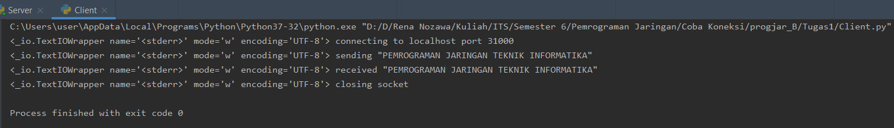
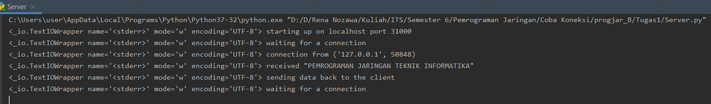
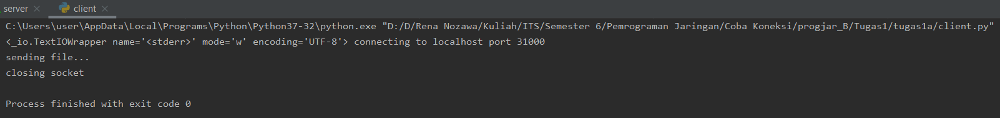

# Tugas1
 
<h2>Tugas1 - Mengirim string pada port 31000</h2>
<h4>Client</h4>

<h4>Server</h4>
  

<h2>Tugas1 - Mengirim string pada port 32000</h2>
<h4>Client</h4>

<h4>Server</h4>
  

<h2>Tugas1 - Mengirim string pada port 33000</h2>
<h4>Client</h4>

<h4>Server</h4>
  

# Tugas1a
 
<h2>Tugas1a - Mengirim file dari client ke server</h2>
<h4>Client</h4>

<h4>Server</h4>

<h4>Folder sebelum</h4>

<h4>Folder sesudah</h4>
  

# Tugas1b
 
<h2>Tugas1b - Mengirim nama file dari client dan dikirimkan file asli dari server</h2>
<h4>Client</h4>

<h4>Server</h4>

<h4>Folder sebelum</h4>

<h4>Folder sesudah</h4>
  
