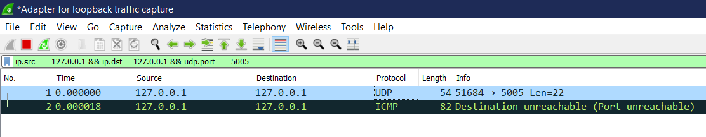
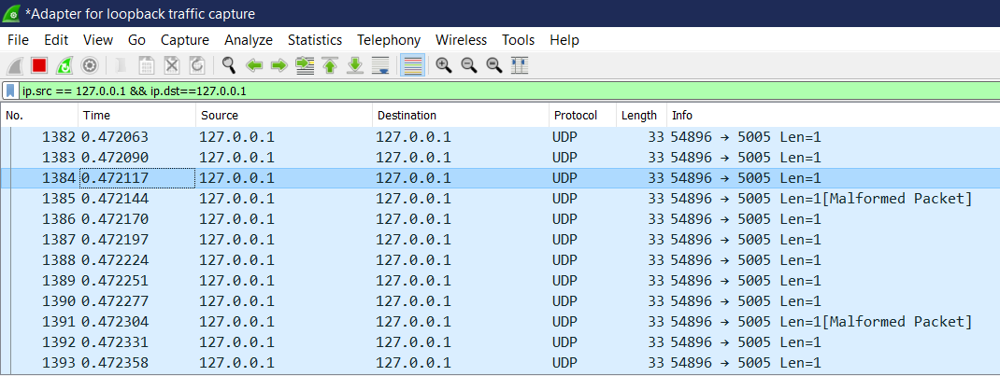
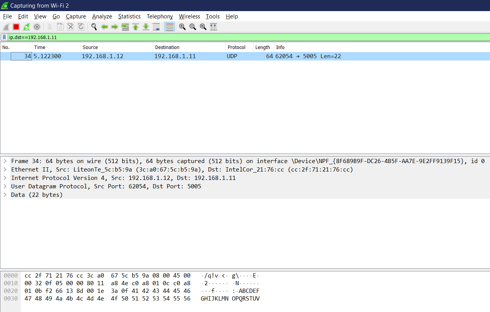
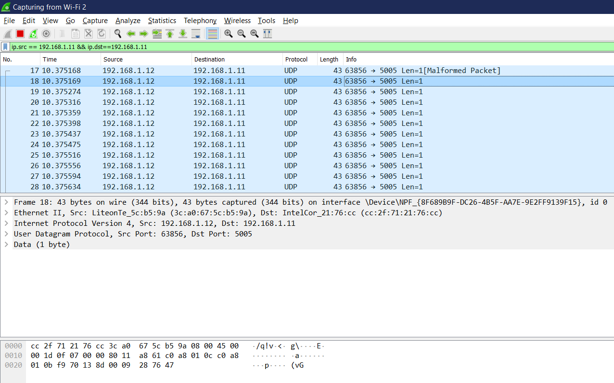

# Tugas2
 

<h2>Satu PC - udp_simple</h2>
 

Menjalankan code udp_simple.py dari dan menuju ip 127.0.0.1 (local)

 

  
<h2>Satu PC - udpfileclient</h2>
 

Menjalankan code udpfileclient.py dari dan menuju ip 127.0.0.1 (local)

 

  
<h2>Antar PC - udp_simple</h2>
 

Menjalankan code udpfileclient.py dari pc saya dengan ip 192.168.1.12 dan menuju ip 192.168.1.11 (antar PC)

 

  
<h2>Antar PC - udpfileclient</h2>
 

Menjalankan code udpfileclient.py dari pc saya dengan ip 192.168.1.12 dan menuju ip 192.168.1.11 (antar PC)

 

  
