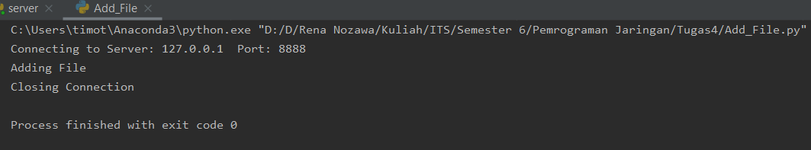
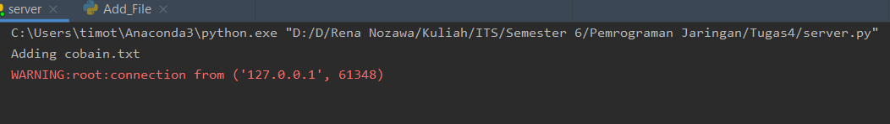
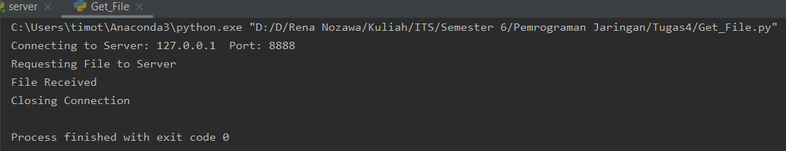
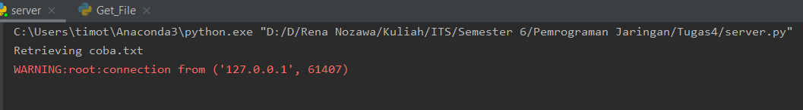
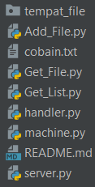
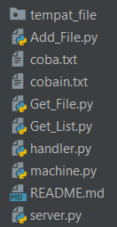
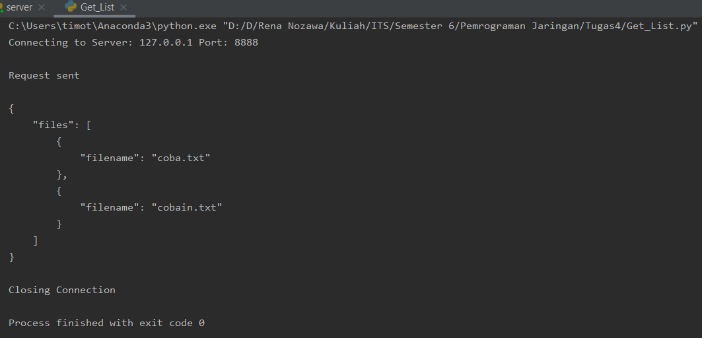
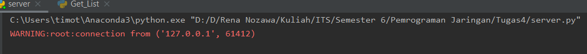

# Tugas4
 

<h2>Format Protokol</h2>

Ketentuan Format: command (spasi) parameter (Untuk menambahkan dan mengambil file)

Ketentuan Format: command (Untuk melihat list file)

  

<h2>Menambahkan File</h2>
 

Ketentuan Format: add (spasi) nama file ( contoh: add coba.txt )

Cara Melakukan Request : Menjalankan server.py lalu menjalankan client Add_File.py

 

 
Server Renponse

  

<h2>Mengambil File</h2>
 

Ketentuan Format: get (spasi) nama file ( contoh: get coba.txt )

Cara Melakukan Request : Menjalankan server.py lalu menjalankan client Get_File.py

 

 
Server Renponse

 
Direktori sebelum dijalankan

 
Direktori setelah dijalankan

  

<h2>Melihat List File</h2>
 

Ketentuan Format: list ( contoh: list )

Cara Melakukan Request : Menjalankan server.py lalu menjalankan client Get_List.py

 

 
Server Renponse

  
