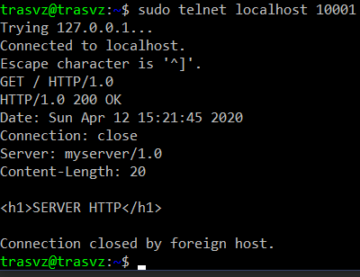

# Tugas6
 

Pertama Jalankan ServerThread.py dulu

 
<h2>Lakukan request dari Telnet</h2>
<h3>Hasil dari Telnet</h3>

<h3>Hasil dari Server</h3>

  

<h2>Lakukan request dari Browser</h2>
<h3>Hasil dari Browser</h3>

<h3>Hasil dari Developer Mode Browser</h3>

<h3>Hasil dari Server</h3>

  
