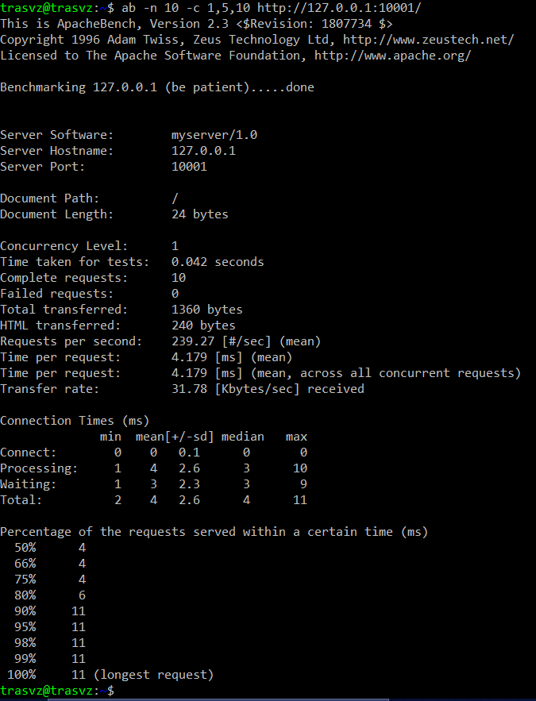
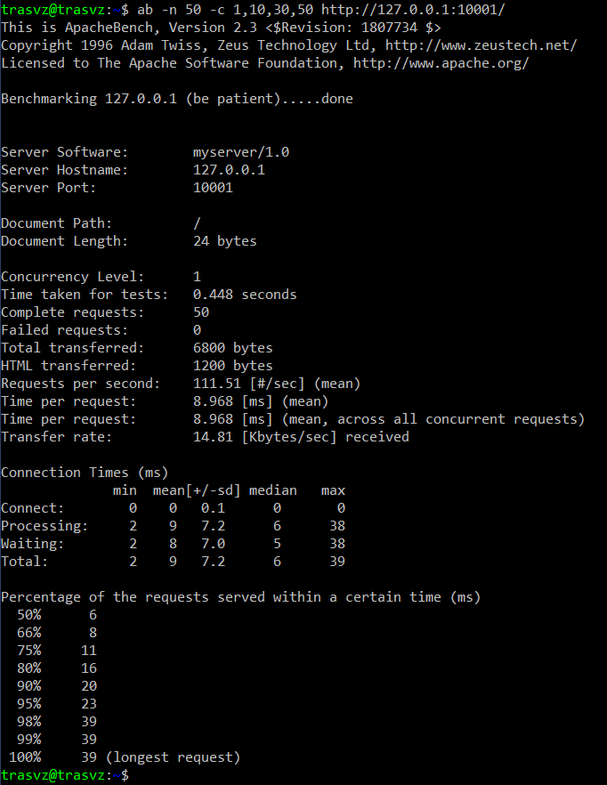
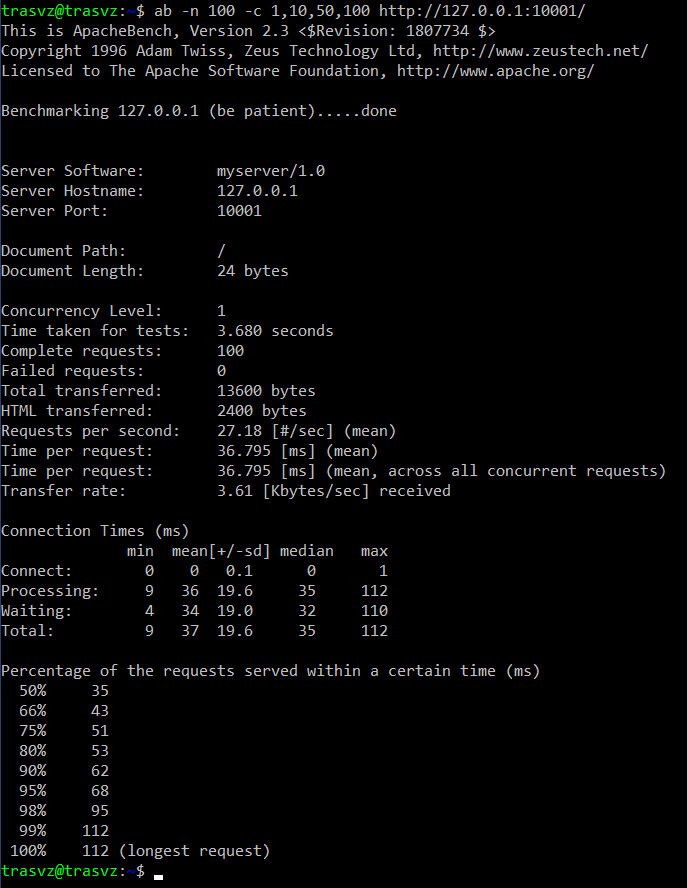

# Tugas7
 

<h2>Hasil benchmark parameter 1</h2>
<h3>Parameter 1: Jumlah Request 10 dan Konkurensi 1, 5, 10</h3>

  

<h2>Hasil benchmark parameter 2</h2>
<h3>Parameter 2: Jumlah Request 50 dan Konkurensi 1, 10, 30, 50</h3>

  

<h2>Hasil benchmark parameter 3</h2>
<h3>Parameter 3: Jumlah Request 10 dan Konkurensi 1, 10, 50, 100</h3>

  

<h2>Tabel Hasil</h2>

